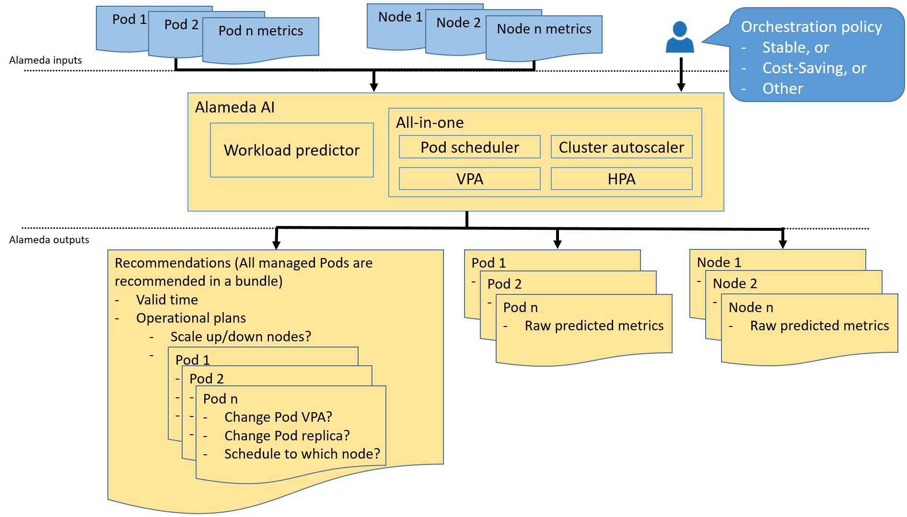
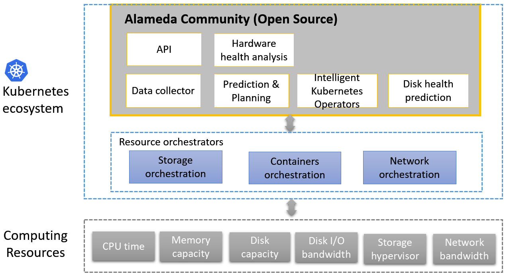
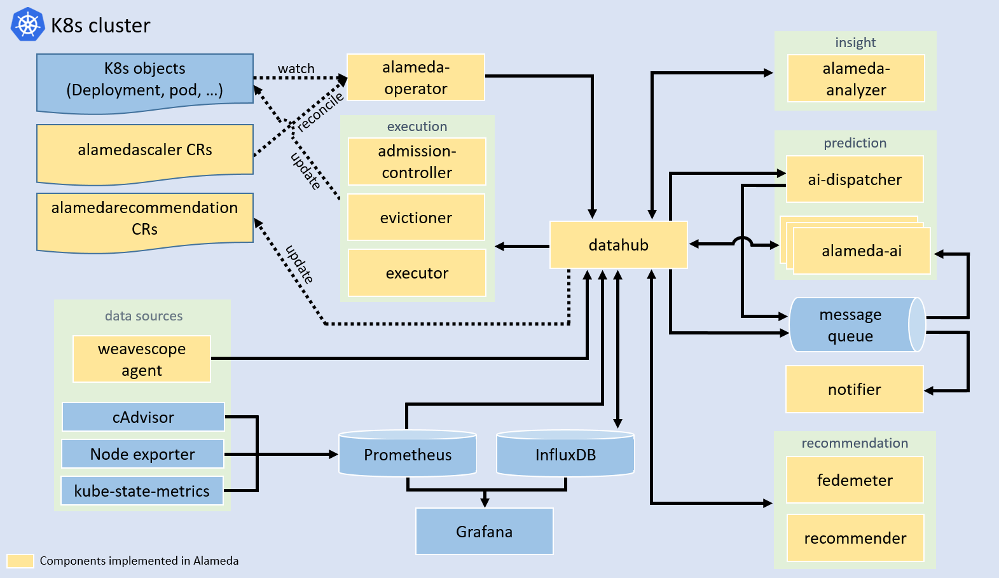
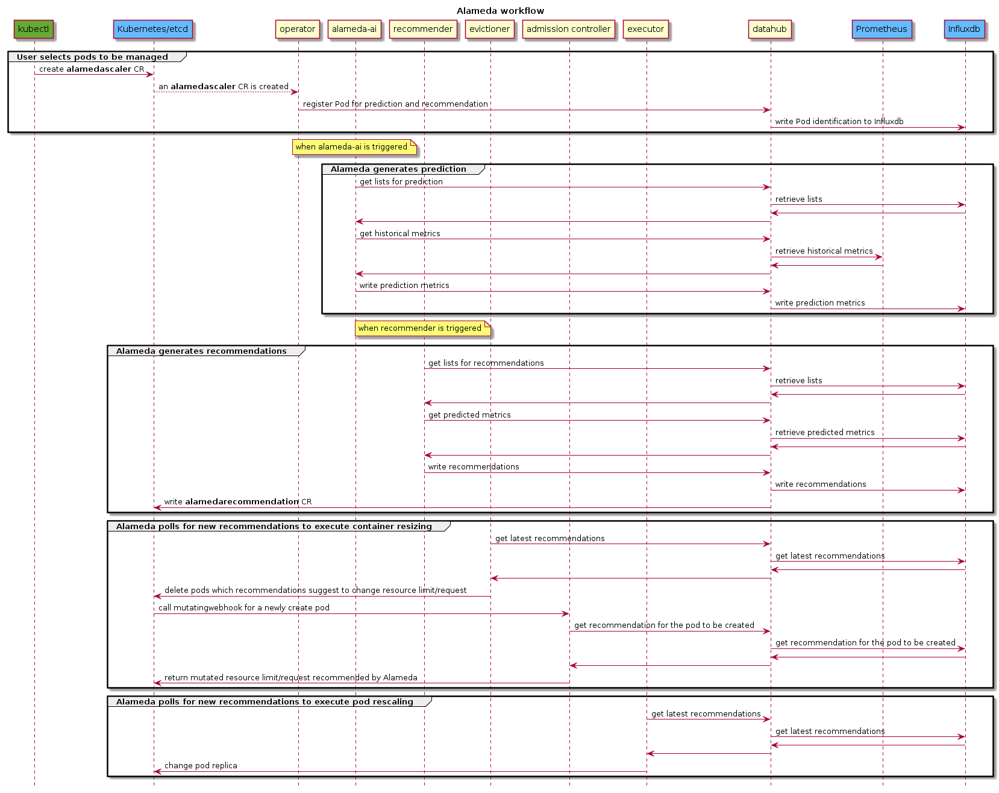

## What is Federator.ai 

Federator.ai provides AI-driven resource orchestration intelligence for Kubernetes. More specifically, it provides the intelligence for autonomous balancing, scaling, and scheduling by using machine learning. Federator.ai learns the continuing changes of computing resources from Kubernetes clusters, predicts the future computing resources demands of pods, and generates resource configuration recommendation for intelligently orchestrating the underlying computing resources without manual configuration.

The following figure illustrates how Federator.ai works in K8S. Users specify Pods and configure Federator.ai with a preferred policy. Then Federator.ai exposes raw predicted metrics and also bundled recommendations for them. Any resource orchestrators can benefit from Federator.ai's output by reacting to these machine-learned intelligence.

## Features

The primary purpose of Federator.ai is to recommend optimal computing resource configuration for Kubernetes by utilizing AI-powered prediction capability. With this, IT admins can leave one of the hardest problems of running Kubernetes to Federator.ai. Features of Federator.ai include:

- AI-driven resource management for CPU, memory, and disks  
    Federator.ai AI Engine generates loading data prediction for the future time. The AI Engine learns patterns from the historical performance metrics of each node and pods running on it. For example, it predicts CPU metrics of the next 24 hours in 1-hour interval. Besides future performance metrics, Federator.ai also detects disk health and predicts life expectancy based on a disk's S.M.A.R.T. value. With these predicted metrics and data, Federator.ai optimizes resource provisioning for Kubernetes.

- Integral scaling considerations  
    When managing Kubernetes clusters, IT admins usually need to take care of how much resources are required by each pod, when a pod needs to scale up/down replicas and when a cluster needs to scale up/down a node. Though several autoscalers such as [VPA](https://github.com/kubernetes/autoscaler/tree/master/vertical-pod-autoscaler), [HPA](https://kubernetes.io/docs/tasks/run-application/horizontal-pod-autoscale/), and [CA](https://github.com/kubernetes/autoscaler/tree/master/cluster-autoscaler) are introduced in Kubernetes, they work reactively and independently. Even more, scaling outcomes might not be desirable due to contradictory settings by humans. With Federator.ai, all these scaling considerations are taken into one integrated global planning.

- Policy-driven optimization  
    Federator.ai provides *stable* and *cost-saving* policies for users to orchestrate resources. With the *stable* policy, users can expect more available resources reserved on each node, which could effectively reduce pod restarting due to insufficient resources for the pods. With *cost-saving* policy, users can expect less running nodes, which could effectively reduce operational spending. This policy-based optimization simplifies resource management complexity. 

- Well integrated into a Kubernetes cluster  
    Federator.ai exposes metrics prediction to a time-series database and operation recommendations via Kubernetes' [CRDs](https://kubernetes.io/docs/concepts/extend-kubernetes/api-extension/custom-resources/). Anyone can leverage these to build up their extensions.

## Federator.ai Position in K8S Ecosystem

As showed in the following figure, Federator.ai is integrated into the Kubernetest ecosystem as the brain of resource orchestration and cooperates with Kubernetes orchestrators by providing metric predictions and resource configuration recommendations.

## Federator.ai Architecture

As the following figure shows, Federator.ai works with following components:

1. Prometheus and those data exporters: Federator.ai leverages Prometheus and third-party data exporters to get historical metrics for model training. Federator.ai itself does not implement data collection agents. Currently Federator.ai requires cAdvisor for cpu and memory metrics prediction.
2. operator: The Federator.ai operator introduces a CRD call *alamedascaler* to provide a channel for users to match Pods for recommendations. It will register those Pods and cluster nodes to alameda-ai for prediction and recommendation.
3. alameda-ai: This is the machine learning engine for model training and workload prediction. It can increase its replica based on how heavy the loading is. Note: it requires a persistent volume to store trained ML models.
4. InfluxDB: This time-series DB is used to store metrics that happened in the future and some global data of Federator.ai.
5. datahub: datahub plays an API and data gateway to access Prometheus, InfluxDB and recommendation CRs. This gateway provides API to alameda-ai for reading metrics and reading/writing predictions and recommendations. Any downstream orchestrator can also access those predictions and recommendations through these API or directly react to InfluxDB and *alamedarecommendation* CRs. This components can increase its replica based on how heavy the loading is.
6. crane (optional): Federator.ai can execute recommendations if this component is deployed.
7. grafana (optional): Users can visualize the predicted workload by this component. A dashboard template of Federator.ai is provided.

To have a minimum set of components of Federator.ai, users just need to deploy *operator*, *alameda-ai*, and *datahub* and provides endpoints for *datahub* to access Prometheus and InfluxDB. The following animated figure shows the decomposition of Federator.ai.

The following message sequence chart demonstrates how Federator.ai normally works.

