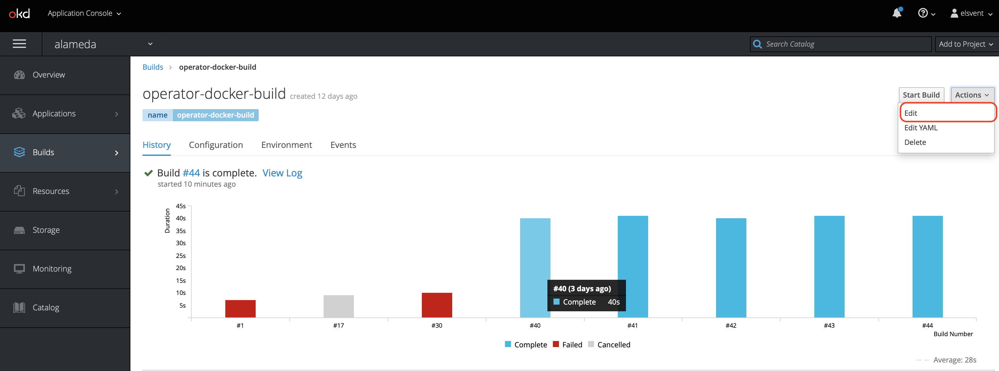
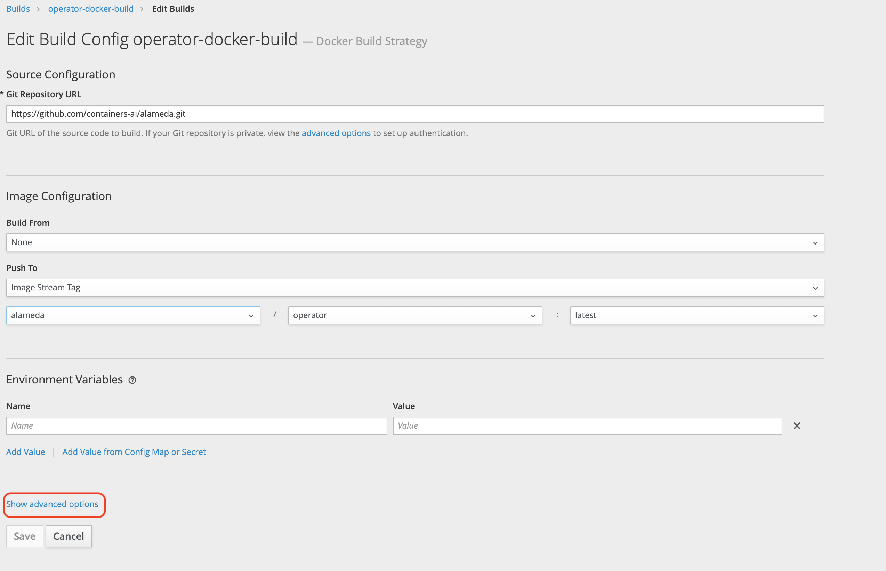

# Deploy alameda/alameda-ai on OKD cluster

## Pre-requirement

1. Setup OKD version 3.11.23 cluster and command line eg: oc, kubectl
2. Configure Prometheus in project openshift-monitoring
3. Create user and setup RBAC policy

## Use Dockerfile build strategy

Login your OKD cluster
```
oc login -u <user> <address>
```

First create project named alameda
```
oc new-project alameda
```

Create imagestream first in registry
```
oc create imagestream alameda-ai
oc create imagestream operator
```

Apply build config
```
oc apply -f build_config
```

## Setup github webhook
go to application console using edit to add github web hook for each build(operator/alameda-ai)

First **select edit**


Second, click on **show advanced options**


Third, create github web hook via **Create New Webhook Secret**


Than save it
Verify this just commit to github build should trigger automatic


## Apply alameda and alameda-ai deploy config
Apply following yaml
```
oc apply -f rbac
oc apply -f crds
oc apply -f service
oc apply -f deployconfig
```

Check pod successful created and running

```
oc get pod
```

log in to pod
```
oc exec -it <pod name> bash
```

After ensure both operator and alameda-ai running execute below command
```
cd <alameda>/example/samples/nginx
oc apply -f nginx_deployment.yaml
oc apply -f alameda_deployment.yaml
```
